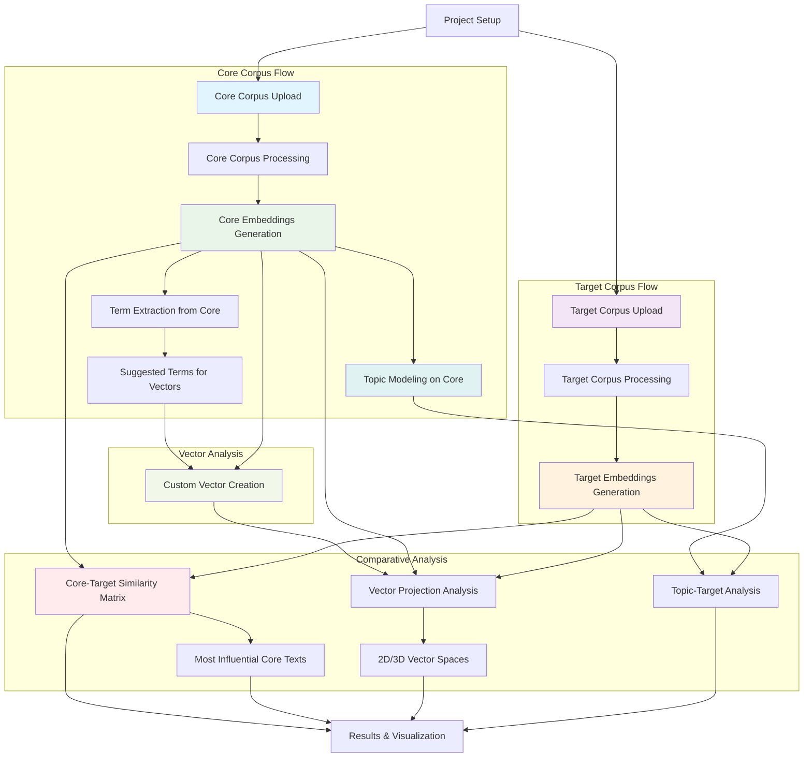

# discourser

A Streamlit application for analyzing the influence of a core corpus of materials against another corpus.

- Python 3.10

## Installation

1. Clone this repository
2. Create a virtual environment: `python -m venv venv`
3. Activate virtual environment: `source venv/bin/activate` (Linux/Mac) or `venv\Scripts\activate` (Windows)
4. Install dependencies: `pip install -r requirements.txt`

You can create a conda environment with:
```bash
conda create -n discourser python=3.10
conda activate discourser
```

## Running the Application

```bash
streamlit run app.py
```

## Usage

1. **Project Setup**: Create or load a project
2. **Core Corpus**: Upload CSV metadata + text files for influential texts
3. **Target Corpus**: Upload corpus to analyze for influence
4. **Analysis**: 
5. **Results**:

Nb the 'save project' is just saving your core and target corpuses; you still need to initialize the embeddings and so on.

## Data Format

### CSV Metadata
Required columns: filename, title, author, date, source
Optional columns: document_type

### Text Files
- UTF-8 encoded .txt files
- Paragraphs separated by double blank lines
- Filename must match CSV metadata



